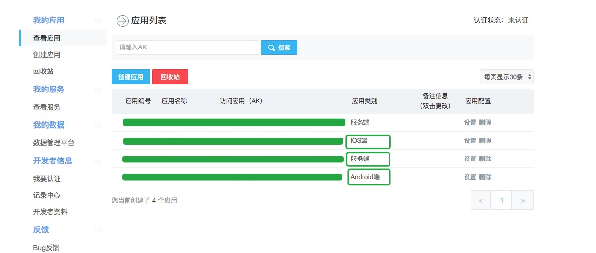
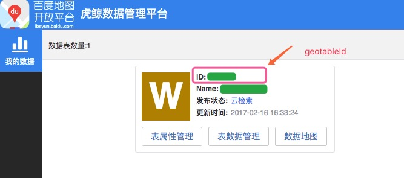

# react-native-baidu-map-guide

基于[react-native-baidu-map](https://github.com/lovebing/react-native-baidu-map) 调用百度地图SDK  

## 基本步骤

- 安装

```
npm install react-native-baidu-map --save
```

- 链接项目

```
react-native link react-native-baidu-map
```

## Android

- Android Studio

经过 `link`操作，基本的设置已经自动生成，但还是检查下比较保险...   

- `setting.gradle` 中添加:

```
include ':react-native-baidu-map'
project(':react-native-baidu-map').projectDir = new File(rootProject.projectDir, '../node_modules/react-native-baidu-map/android')
```

原文章中是`settingsDir`但我关联自动生成的是`rootProject`，这个不懂，待了解后更正，但不影响使用    

- 在`app` 目录下 `build.gradle` 中添加:
```
compile project(':react-native-baidu-map')
```

- 在`MainApplication.java`中添加：
```
new BaiduMapPackage(getApplicationContext())
```

- 在`AndroidManifest.xml` 中添加：
```
<meta-data android:name="com.baidu.lbsapi.API_KEY" android:value="Your_Baidu_Android_Client_Key"/>
```

**注** 这里是安卓移动端的key

### 关键代码解读

- `BaseModule.java`

继承`ReactContextBaseJavaModule` 用于链接react-native 与 Java 的桥梁    

`sendEvent` 事件发送方法

- `BaiduMapModule.java`

`getName` 返回当前模块名称，Java向JS抛出的模块名

- `BaiduMapPackage.java`
`createNativeModules` 创建原生模块，这里返回一个Java抛出的模块集合，用于JS中可以通过模块名调用

`createViewManagers` 创建视图管理器

- `BaiduMapViewManager.java`

继承`ViewGroupManager<com.baidu.mapapi.map.MapView>`    
`createViewInstance` 创建实例

`setMarker`设置中心坐标标注函数，这里可以覆写下根据跟人要求显示当前位置，如显示当前位置的小圆点:

```java
MyLocationData.Builder lb = new MyLocationData.Builder();

LatLng latLng = MarkerUtil.getLatLngFromOption(option);

lb.latitude(latLng.latitude);
lb.longitude(latLng.longitude);

MyLocationData data = lb.build();
BaiduMap baiduMap = mapView.getMap();
baiduMap.setMyLocationEnabled(true);
baiduMap.setMyLocationData(data);
```

`setOnMarkerClickListener` 标注点击回调方法

由于返回的是一个`WritableMap`这里你可以返回一些自定义的参数类型,和获取mark返回的自定义参数类型,如：`type` `age` ...
```java
Bundle bundle = marker.getExtraInfo(); // 获取Marker返回的自定义参数

writableMap.putXXX("key",bundle.getXXX("key")); // 返回自定义参数到JS
```

同样的在`MarkerUtil`中`updateMarker` 和 `addMarker`是需要添加自定参数

- `GeolocationModule.java`
定义地图坐标转换等操作   
添加自定的JS调用API（LBS）  

**注** LBS 使用的是`服务端` AK

```java
@ReactMethod
public void someMethod(Double lat, Double lng){

    if(lat == null || lng == null){
        WritableMap params = Arguments.createMap();
        params.putInt("code",1);
        params.putString("message","经纬度为空");
        sendEvent("onCloudSearchResult",params);
    }else{
        NearbySearchInfo nearbySearchInfo = new NearbySearchInfo(); // 周边搜索

        nearbySearchInfo.ak = this.BAIDU_MAP_SERVER_AK;             // 服务端 AK
        nearbySearchInfo.geoTableId = this.GEO_TABLE_ID;            // 管理平台
        nearbySearchInfo.radius = this.RADIUS;                      // 搜索半径
        nearbySearchInfo.pageSize = this.PAGE_SIZE;                 // 中心点
        nearbySearchInfo.location = lng + "," + lat;
        if(this.cloudManager == null){
            this.cloudManager = CloudManager.getInstance();         // 初始化
            initCloudListener();                                    // 设置监听
        }
        this.cloudManager.nearbySearch(nearbySearchInfo);           // 搜索
    }
}


private void initCloudListener(){
  this.cloudManager.init(new CloudListener() {
      @Override
      public void onGetSearchResult(CloudSearchResult cloudSearchResult, int i) {
          System.out.println("cloudSearchResult:" + cloudSearchResult);

          if(cloudSearchResult == null || cloudSearchResult.size == 0){
              WritableMap params = Arguments.createMap();
              params.putInt("code",2);
              params.putString("message","没有查询到数据");
              sendEvent("SOME_EVENT",params);
          }else{
              WritableMap params = Arguments.createMap();
              WritableArray writableArray = new WritableNativeArray();
              List<CloudPoiInfo> poiInfos= cloudSearchResult.poiList;
              for(int j = 0; j< poiInfos.size(); j++){
                  WritableMap paramItem = Arguments.createMap();
                  CloudPoiInfo info = poiInfos.get(j);

                  paramItem.putInt("geotableId",info.geotableId); // 获取基本参数
                  ...

                  Map<String, Object> extras = info.extras;       // 获取自定义参数

                  int age = (int) extras.get("age");
                  paramItem.putInt("age",age);
                  ...

                  writableArray.pushMap(paramItem);
              }
              params.putInt("code",0);
              params.putString("message","数据返回成功");
              params.putArray("data",writableArray);
              sendEvent("SOME_EVENT",params);
          }
      }

      @Override
      public void onGetDetailSearchResult(DetailSearchResult detailSearchResult, int i) {
          System.out.println("onGetDetailSearchResult in java");
      }
  });
}
```

### 编辑`react-native-baidu-map`项目JS文件

修改里面JS添加自定义的方法并抛出给react-native使用

## IOS

吐槽下，由于不懂IOS导致各种不顺😢...     

- [环境搭建](http://lbsyun.baidu.com/index.php?title=iossdk/guide/buildproject)
参考文档使用`Pod`安装，需要注意的是`Podfile`需要指定sdk的版本，其他安装问题参考度娘

```
platform :ios,'10.2'
target "wabg" do
pod 'BaiduMapKit','~> 3.2.1'
end
```

通过`link`命令应该就可以直接在`Libraries`中看到`RCTBaiduMap`项目了，**对了你还需要申请一个`IOS` 端的AK**

### 关键代码解读

IOS的代码大体和android差不多，应该能看懂   

- `RCTBaiduMapView.m` 中定义mapView的属性

- `RCTBaiduMapViewManager.m` 中定义了回调函数（onClickMarker）

- `GeolocationModule.m` 中定义了定位方便的东东

**同样需要注意**    

- IOS移动端AK
- 服务端AK（如果使用LBS的话）

周边检索为例，抛出JS调用方法

`GeolocationModule.m`   

```objective-c
RCT_EXPORT_METHOD(nearbySearch:(NSString*) lat lng:(NSString*)lng){
    // 获取search对象并指定委托对象
    [self getCloudSearch].delegate = self;
    
    BMKCloudNearbySearchInfo *cloudNearbySearch = [[BMKCloudNearbySearchInfo alloc]init];
    // 设置百度地图 服务端 ak
    cloudNearbySearch.ak = @"Baidu_Map_Server_Key";
    // 设置百度地图 LBS 云存储的table id
    cloudNearbySearch.geoTableId = xxxxx;
    // cloudNearbySearch.pageIndex = 0; 默认值
    // cloudNearbySearch.pageSize = 10; 默认值
    // 格式化经纬度
    NSString *selfLocateStr = [NSString stringWithFormat:@"%@,%@",lng, lat];
    // 设置搜索中心
    cloudNearbySearch.location = selfLocateStr;
    // 设置搜索半径
    cloudNearbySearch.radius = 5000;
    // 设置所有标签
    // cloudNearbySearch.tags = @"tags";
    // 设置搜索关键字，**必需值** ,搜索全部传递一个空格字符串
    cloudNearbySearch.keyword = @" ";
    
    BOOL flag = [_search nearbySearchWithSearchInfo:cloudNearbySearch];
    if(flag)
    {
        NSLog(@"周边云检索发送成功");
    }
    else
    {
        NSLog(@"周边云检索发送失败");
    }
    
}

// 初始化搜索对象
-(BMKCloudSearch *)getCloudSearch{
    if(_search == nil) {
        _search = [[BMKCloudSearch alloc]init];    }
    return _search;
}


/**
 * 搜素结果回调函数
 * poiResultList 结果列表
 * searchType 搜索类型，如周边搜索，poi搜索...
 * errorCode 错误编号，0为正常
 */
- (void)onGetCloudPoiResult:(NSArray*)poiResultList searchType:(int)type errorCode:(int)error
{
    /**
     * body[@"code"] = [NSString stringWithFormat:@"%d", error]; 格式化非字符串类型值并传递参数，%d 整形，%f浮点型，%@字符型
     * body[@"message"] = @"没有数据返回"; 字符串直接赋值
     *
     */
    
    NSMutableDictionary *body = [self getEmptyBody];

    [body setObject:[NSNumber numberWithInt:error] forKey:@"code"];
    
    if (error == BMK_CLOUD_NO_ERROR) {
        BMKCloudPOIList* result = [poiResultList objectAtIndex:0];
        if(0 == [result size]){
            [body setObject:[NSNumber numberWithInt:10] forKey:@"code"];
            [body setObject:@"没有数据返回" forKey:@"message"];
        }else{
            body[@"message"] = @"周边数据检索成功";
            NSMutableArray * dataArray = [[NSMutableArray alloc]init];
            
            for (int i = 0; i < result.POIs.count; i++) {
                NSMutableDictionary *item = [self getEmptyBody];
                
                BMKCloudPOIInfo* poi = [result.POIs objectAtIndex:i];
                
                [item setObject:poi.tags forKey:@"tags"];
                [item setObject:poi.address forKey:@"address"];
                [item setObject:[NSNumber numberWithFloat:poi.longitude] forKey:@"latitude"]; // 这里SDK返回Key Value 没有一致，已提交issue，希望他们会改...
                [item setObject:[NSNumber numberWithFloat:poi.latitude] forKey:@"longitude"];
                [item setObject:[NSNumber numberWithInt:poi.geotableId] forKey:@"geotableId"];
                [item setObject:poi.title forKey:@"title"];
                
                //自定义字段
                if(poi.customDict!=nil&&poi.customDict.count>1)
                {
                    /**
                     * 非空判断
                     */
                    if([poi.customDict objectForKey:@"age"] != nil){
                        [item setObject:[poi.customDict objectForKey:@"age"] forKey:@"age"];
                    }
                    ...
                }
                
                [dataArray addObject:item];
            }
            body[@"data"] = dataArray;
        }
    } else {
        NSLog(@"error = %d",error);
        [body setObject:@"周边数据获取失败" forKey:@"message"];
    }
    [self sendEvent:@"SOME_EVENT" body:body];
}
```

跟安卓一样点击标注物时也要返回自定义数据那怎么弄呢？？

- 定义一个类`CusBMKPointAnnotation`继承`BMKPointAnnotation`

```objective-c
#import <BaiduMapAPI_Map/BMKPointAnnotation.h>

@interface CusBMKPointAnnotation : BMKPointAnnotation

@property NSNumber* age;

@end

```

- `RCTBaiduMapView.m` 中修改`updateMarker`方法
**注意** 这个文件里面使用到的annotation都应该是自己定义的类`CusBMKPointAnnotation`

```objective-c
// 更新标注物
-(void)updateMarker:(CusBMKPointAnnotation *)annotation option:(NSDictionary *)option {
    CLLocationCoordinate2D coor = [self getCoorFromMarkerOption:option];
    NSString *title = [RCTConvert NSString:option[@"title"]];
    if(title.length == 0) {
        title = nil;
    }
    
    annotation.coordinate = coor;
    annotation.title = title;
    /**
     *
     * 以下部分为更新标注物，并返回自定义参数
     * 如果参数不存在或值为nil 默认返回 0 或 @""，JS中就可以通过 (!!parameter)
     */
    
    if([option objectForKey:@"age"] == nil){
        annotation.age = [NSNumber numberWithInt:0];
    }else{
        annotation.age = [option objectForKey:@"age"];
    }
}
```

- `RCTBaiduMapViewManager.m` 中修改`didSelectAnnotationView`

```objective-c
-(void)mapView:(BMKMapView *)mapView
didSelectAnnotationView:(BMKAnnotationView *)view {
    /**
     * 强转为自定义的标注物类 CusBMKPointAnnotation
     * 并添加自定义参数
     */
    
    CusBMKPointAnnotation *_new = (CusBMKPointAnnotation *)[view annotation];

    NSDictionary* event = @{
                            @"type": @"onMarkerClick",
                            @"params": @{
                                    @"title": [_new title],
                                    @"position": @{
                                            @"latitude": @([_new coordinate].latitude),
                                            @"longitude": @([_new coordinate].longitude)
                                            },
                                    @"age": [_new age]
                                    }
                            };
    [self sendEvent:mapView params:event];
}
```


**提醒：**

- 千万使用真机测试
- LBS填写的是服务端AK
- geotableId 就是管理平台创建表后的id
- IOS LBS 的keyword是必填项

  
======


## 参考文档

- [react-native-nativeModule](https://github.com/Xing-He/react-native-nativeModule)

### Android
- [BaiduMapKit](https://github.com/hufeng/BaiduMapKit)
- [LbsMap](https://github.com/CarGuo/LbsMap)
- [Android端百度地图API使用详解](http://www.cnblogs.com/rocomp/p/4994110.html)
- [认识百度地图常用类](http://blog.csdn.net/u012938203/article/details/49310471)

### IOS

- [BaiduMap-iOS-SDK](https://github.com/iosmvn/BaiduMap-iOS-SDK)
- [BaiduMapDemo](https://github.com/hrscy/BaiduMapDemo)